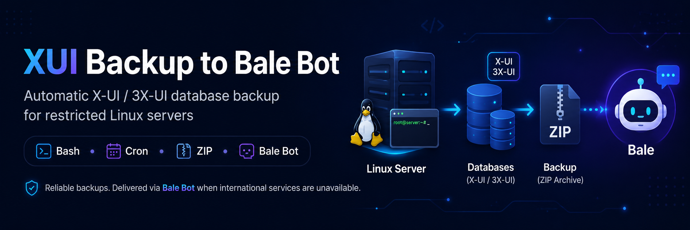

<p align="center">
  
</p>

# XUI Backup to Bale Bot

### ارسال خودکار بکاپ دیتابیس X-UI و 3X-UI به ربات بله


---

## معرفی پروژه

**XUI Backup to Bale Bot** یک اسکریپت ساده و سبک Bash برای بکاپ‌گیری خودکار از دیتابیس پنل‌های **X-UI** و **3X-UI** است.

این اسکریپت مسیرهای رایج دیتابیس X-UI و 3X-UI را بررسی می‌کند، فایل‌های موجود را داخل یک فایل ZIP قرار می‌دهد، آن فایل را از طریق **ربات پیام‌رسان بله** ارسال می‌کند و بعد از ارسال موفق، فایل ZIP را از روی سرور حذف می‌کند.

---

## چرا ارسال بکاپ به بله؟

در حالت عادی، بهتر است بکاپ‌ها به مکان‌های امن‌تر و استانداردتری منتقل شوند؛ مثل:

- سرور بکاپ جداگانه
- SFTP / FTP
- فضای ابری
- S3
- تلگرام
- سیستم‌های مانیتورینگ و بکاپ حرفه‌ای

اما بعضی سرورها در شرایط خاص قرار دارند؛ مثلاً:

- دسترسی به اینترنت بین‌الملل ندارند
- به تلگرام متصل نمی‌شوند
- امکان اتصال به سرویس‌های خارجی وجود ندارد
- فقط دسترسی داخلی یا محدود دارند
- نیاز فوری به انتقال بکاپ وجود دارد

در چنین شرایطی، ارسال بکاپ به ربات بله می‌تواند یک راهکار ساده، سریع و کاربردی برای رفع نیاز باشد.

> این پروژه جایگزین بکاپ‌گیری حرفه‌ای و امن نیست.  
> این اسکریپت بیشتر برای شرایط محدودیت ارتباطی، اضطراری یا سرورهایی طراحی شده که دسترسی مناسبی به سرویس‌های بین‌المللی ندارند.

---

## امکانات

- بکاپ‌گیری خودکار از دیتابیس‌های X-UI و 3X-UI
- بررسی چند مسیر رایج دیتابیس
- ساخت فایل ZIP
- ارسال فایل ZIP به ربات بله
- نوشتن تاریخ و زمان ارسال زیر فایل در بله
- حذف خودکار فایل ZIP بعد از ارسال موفق
- تنظیم فاصله اجرای خودکار بر اساس دقیقه
- ساخت Cron Job از داخل خود اسکریپت
- منوی ساده و مرتب
- امکان اجرای دستی بکاپ
- امکان مشاهده تنظیمات فعلی
- امکان مشاهده لاگ آخرین اجرا
- امکان حذف Cron Job
- بدون نصب خودکار پکیج داخل اسکریپت
- مناسب برای سرورهای دارای محدودیت اینترنت بین‌الملل

---

## مسیرهای پشتیبانی‌شده دیتابیس

اسکریپت به صورت پیش‌فرض این مسیرها را بررسی می‌کند:

```text
/etc/x-ui/x-ui.db
/usr/local/x-ui/x-ui.db
/etc/3x-ui/x-ui.db
/usr/local/3x-ui/x-ui.db
/opt/x-ui/x-ui.db
/opt/3x-ui/x-ui.db
```

اگر هرکدام از این فایل‌ها وجود داشته باشند، داخل فایل ZIP قرار می‌گیرند.

---

## پیش‌نیازها

این اسکریپت چیزی را به صورت خودکار نصب نمی‌کند.

قبل از اجرا، باید این ابزارها روی سرور شما وجود داشته باشند:

```text
bash
curl
zip
cron / crontab
flock
```

روی بیشتر سرورهای لینوکسی، این ابزارها معمولاً از قبل وجود دارند.

---

## ساخت ربات بله

برای استفاده از اسکریپت باید یک ربات در پیام‌رسان بله بسازید.

### 1. ساخت ربات در بله

در پیام‌رسان بله وارد ربات زیر شوید:

```text
@botfather
```

یک ربات جدید بسازید و توکن ربات را دریافت کنید.

توکن ربات چیزی شبیه این است:

```text
123456789:xxxxxxxxxxxxxxxxxxxxxxxxxxxxxxxx
```

این توکن را هنگام تنظیم اسکریپت وارد می‌کنید.

---

### 2. دریافت آیدی عددی اکانت بله

برای اینکه ربات بتواند فایل بکاپ را برای شما ارسال کند، باید `CHAT_ID` عددی حساب بله خود را داشته باشید.

برای دریافت آیدی عددی، در بله وارد ربات زیر شوید:

```text
@ShowChatdBot
```

آیدی عددی دریافت‌شده را هنگام تنظیم اسکریپت وارد کنید.

---

## نصب سریع روی سرور

برای نصب سریع، دستور زیر را روی سرور اجرا کنید:

```bash
sudo bash <(curl -fsSL https://raw.githubusercontent.com/TIR3D4/xui-backup-bale/main/bale_xui_backup.sh)
```

اگر با کاربر root وارد سرور شده‌اید، می‌توانید بدون `sudo` اجرا کنید:

```bash
bash <(curl -fsSL https://raw.githubusercontent.com/TIR3D4/xui-backup-bale/main/bale_xui_backup.sh)
```

---

## نصب دستی روی سرور

اگر می‌خواهید اسکریپت را دستی روی سرور بسازید، مراحل زیر را انجام دهید.

### 1. ساخت فایل اسکریپت

```bash
nano bale_xui_backup.sh
```

کد اسکریپت را داخل فایل قرار دهید و ذخیره کنید.

---

### 2. دادن دسترسی اجرا

```bash
chmod +x bale_xui_backup.sh
```

---

### 3. اجرای اسکریپت

```bash
sudo ./bale_xui_backup.sh
```

یا اگر با کاربر root هستید:

```bash
./bale_xui_backup.sh
```

---

## منوی اسکریپت

بعد از اجرا، منوی زیر نمایش داده می‌شود:

```text
------------------------------------------------------------
 Bale X-UI Backup Sender
------------------------------------------------------------

Choose an option:

  1) Setup or update cron job
  2) Run backup now
  3) Show current config
  4) Show last log
  5) Remove cron job
  0) Exit

Select option:
```

---

## راه‌اندازی بکاپ خودکار

برای فعال‌سازی ارسال خودکار بکاپ، از منو گزینه زیر را انتخاب کنید:

```text
1) Setup or update cron job
```

سپس اسکریپت این اطلاعات را از شما می‌پرسد:

```text
Enter Bale bot token:
Enter destination CHAT_ID:
Enter backup file name:
Run every how many minutes? [1-59]:
```

مثال:

```text
Enter backup file name: xui_backup
Run every how many minutes? [1-59]: 5
```

در این مثال، اسکریپت هر 5 دقیقه یک بار اجرا می‌شود.

---

## اجرای دستی بکاپ

برای اجرای دستی بکاپ از طریق منو، گزینه زیر را انتخاب کنید:

```text
2) Run backup now
```

یا با دستور زیر اجرا کنید:

```bash
sudo ./bale_xui_backup.sh --run
```

---

## مشاهده تنظیمات فعلی

از داخل منو گزینه زیر را انتخاب کنید:

```text
3) Show current config
```

یا با دستور زیر اجرا کنید:

```bash
sudo ./bale_xui_backup.sh --config
```

---

## مشاهده لاگ

فایل لاگ پیش‌فرض اسکریپت:

```text
/tmp/bale_xui_backup.log
```

برای مشاهده لاگ:

```bash
cat /tmp/bale_xui_backup.log
```

یا از داخل منو گزینه زیر را انتخاب کنید:

```text
4) Show last log
```

---

## حذف اجرای خودکار

برای حذف Cron Job از داخل منو گزینه زیر را انتخاب کنید:

```text
5) Remove cron job
```

یا با دستور زیر اجرا کنید:

```bash
sudo ./bale_xui_backup.sh --uninstall
```

---

## فایل‌های ساخته‌شده توسط اسکریپت

اسکریپت ممکن است فایل‌های زیر را بسازد:

```text
/etc/bale_xui_backup.conf
/tmp/bale_xui_backup.log
/tmp/bale_xui_backup.lock
```

توضیح فایل‌ها:

```text
/etc/bale_xui_backup.conf   فایل تنظیمات شامل توکن، chat_id و نام بکاپ
/tmp/bale_xui_backup.log    لاگ آخرین اجرای cron
/tmp/bale_xui_backup.lock   فایل قفل برای جلوگیری از اجرای همزمان چند بکاپ
```

---

## نمونه نام فایل بکاپ

اگر هنگام تنظیم، نام بکاپ را این مقدار وارد کنید:

```text
xui_backup
```

فایل ارسالی به شکل زیر خواهد بود:

```text
xui_backup_2026-05-07_14-30-00.zip
```

---

## نمونه کپشن فایل در بله

زیر فایل ارسالی در بله، تاریخ و زمان ارسال نوشته می‌شود:

```text
Backup file: xui_backup
Date: 2026-05-07 14:30:00
```

---

## نکات امنیتی مهم

- توکن ربات بله را در اختیار دیگران قرار ندهید.
- فایل دیتابیس X-UI ممکن است شامل اطلاعات حساس باشد.
- بکاپ را در گروه‌ها یا کانال‌های عمومی ارسال نکنید.
- بهتر است ربات فقط برای همین کار استفاده شود.
- فایل تنظیمات در مسیر زیر ذخیره می‌شود:

```text
/etc/bale_xui_backup.conf
```

- دسترسی فایل تنظیمات به صورت محدود تنظیم می‌شود:

```text
chmod 600 /etc/bale_xui_backup.conf
```

- این روش برای شرایط اضطراری و محدودیت ارتباطی پیشنهاد می‌شود، نه به عنوان راهکار بکاپ سازمانی.

---

## خطاهای رایج

### خطای پیدا نشدن دیتابیس

اگر این پیام را دیدید:

```text
No x-ui.db files found.
```

یعنی دیتابیس در مسیرهای پیش‌فرض پیدا نشده است.

برای پیدا کردن مسیر دیتابیس روی سرور:

```bash
find / -name "x-ui.db" 2>/dev/null
```

بعد از پیدا کردن مسیر جدید، می‌توانید آن را به بخش `FILES` داخل اسکریپت اضافه کنید.

---

### ارسال فایل انجام نمی‌شود

برای بررسی مشکل، لاگ را ببینید:

```bash
cat /tmp/bale_xui_backup.log
```

موارد زیر را بررسی کنید:

- توکن ربات درست باشد
- `CHAT_ID` درست باشد
- سرور به آدرس `tapi.bale.ai` دسترسی داشته باشد
- ابزارهای `curl` و `zip` روی سرور وجود داشته باشند
- ربات در بله فعال باشد
- حساب بله شما قبلاً به ربات پیام داده باشد

---

### Cron Job اجرا نمی‌شود

لیست cron را بررسی کنید:

```bash
crontab -l
```

اگر اسکریپت را با `sudo` یا کاربر root نصب کرده‌اید، این مورد را هم بررسی کنید:

```bash
sudo crontab -l
```

---

## ساختار پیشنهادی ریپو

```text
xui-backup-bale/
├── README.md
├── bale_xui_backup.sh
└── LICENSE
```

---

## دستورات پیشنهادی برای آپلود در GitHub

اگر می‌خواهید پروژه را از داخل سرور یا سیستم خودتان به GitHub ارسال کنید:

```bash
git init
git add README.md bale_xui_backup.sh LICENSE
git commit -m "Initial release"
git branch -M main
git remote add origin https://github.com/TIR3D4/xui-backup-bale.git
git push -u origin main
```

---

## به‌روزرسانی اسکریپت

اگر بعداً نسخه جدیدی از اسکریپت منتشر شد، می‌توانید فایل را دوباره دانلود و جایگزین کنید:

```bash
curl -fsSL https://raw.githubusercontent.com/TIR3D4/xui-backup-bale/main/bale_xui_backup.sh -o bale_xui_backup.sh
chmod +x bale_xui_backup.sh
```

سپس دوباره اجرا کنید:

```bash
sudo ./bale_xui_backup.sh
```

---

## پیشنهاد استفاده

برای استفاده بهتر:

- ابتدا گزینه `2` را برای تست دستی اجرا کنید.
- اگر فایل با موفقیت در بله ارسال شد، گزینه `1` را برای فعال‌سازی cron بزنید.
- فاصله زمانی خیلی کم انتخاب نکنید.
- برای استفاده معمول، فاصله‌هایی مثل 30، 60 یا 120 دقیقه منطقی‌تر هستند.
- برای سرورهای حساس، از چند روش بکاپ‌گیری همزمان استفاده کنید.

---

## مشارکت

اگر ایده‌ای برای بهتر شدن پروژه دارید، خوشحال می‌شوم مشارکت کنید.

می‌توانید:

- پروژه را Fork کنید
- باگ‌ها را گزارش کنید
- Pull Request ارسال کنید
- پیشنهادهای امنیتی یا فنی بدهید

---

## لایسنس

این پروژه تحت لایسنس MIT منتشر شده است.

---

## حمایت

اگر این پروژه برای شما مفید بود:

- به پروژه Star بدهید
- آن را با دیگران به اشتراک بگذارید
- باگ‌ها و پیشنهادهای خود را ثبت کنید

---

Made with ❤️ for restricted Linux servers
